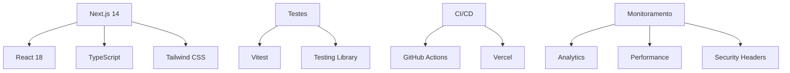

# 🛡️ YesLinux – Tecnologia em Software Livre

<div align="center">
  
  **Segurança, liberdade e inovação em cada linha de código**
  
  [](https://sonarcloud.io/summary/new_code?id=bob-reis_site-yeslinux)
  [](https://sonarcloud.io/summary/new_code?id=bob-reis_site-yeslinux)
  [](https://github.com/bob-reis/site-yeslinux/actions/workflows/test.yml)
  [](https://github.com/bob-reis/site-yeslinux/actions/workflows/security.yml)

  [🌐 Site ao Vivo](https://site-yeslinux.vercel.app) • [📚 Documentação](./docs) • [🐛 Reportar Bug](https://github.com/bob-reis/site-yeslinux/issues/new?template=bug_report.md) • [✨ Solicitar Feature](https://github.com/bob-reis/site-yeslinux/issues/new?template=feature_request.md)
</div>

---

## 🚀 Sobre o Projeto

Site institucional da **YesLinux**, empresa especializada em **software livre**, **cibersegurança** e **inovação tecnológica**. Este projeto serve como vitrine das nossas competências técnicas e metodologias de desenvolvimento seguro.

### 🎯 Objetivos

- ✅ **Vitrine Tecnológica:** Demonstrar excelência em desenvolvimento web moderno
- ✅ **Segurança First:** Implementar as melhores práticas de segurança desde o código
- ✅ **Performance:** Otimização extrema para velocidade e experiência do usuário
- ✅ **Acessibilidade:** Compliance total com WCAG 2.1 AA
- ✅ **SEO:** Otimização avançada para motores de busca
- ✅ **UI Hacker:** Cabeçalho de navegação com links gerados dinamicamente e seção de serviços com cards interativos

### 🏗️ Arquitetura



## 🛠️ Stack Tecnológico

### Frontend
- **Framework:** Next.js 14 (App Router)
- **Language:** TypeScript 5.4+
- **UI Library:** React 18.3+
- **Styling:** Tailwind CSS 3.4+ (processado via PostCSS com Autoprefixer)
- **Animations:** Framer Motion 11+
- **3D Graphics:** Three.js + React Three Fiber
- **Icons:** Lucide React
- **State:** Zustand 4.5+

### Development & Quality
- **Testing:** Vitest + Testing Library
- **Type Checking:** TypeScript (strict mode)
- **Linting:** ESLint + Next.js config
- **Code Formatting:** Prettier (via ESLint)
- **Git Hooks:** (opcional) Husky + lint-staged

### CI/CD & Deployment  
- **CI/CD:** GitHub Actions
- **Hosting:** Vercel
- **Security:** CodeQL + OWASP Dependency Check
- **Coverage:** Codecov

## 📋 Requisitos do Sistema

- **Node.js:** 18.17+ ou 20.x
- **npm:** 9.6.7+
- **Git:** 2.34+

## ⚡ Quick Start

### 1. Instalação

```bash
# Clone o repositório
git clone https://github.com/bob-reis/site-yeslinux.git
cd site-yeslinux

# Instale as dependências
npm install

# Configure o ambiente
cp .env.example .env.local
# Edite .env.local com suas configurações
```

### 2. Desenvolvimento

```bash
# Inicie o servidor de desenvolvimento
npm run dev

# Execute os testes
npm test

# Verificação de qualidade
npm run lint
npm run build
```

### 3. URLs de Desenvolvimento

- **Aplicação:** http://localhost:3000
- **Coverage:** http://localhost:3000/coverage (após `npm test`)

## 🧪 Testes e Qualidade

### Cobertura de Código
```bash
npm test                 # Executa todos os testes com cobertura
npm run test:watch       # Modo watch para desenvolvimento  
npm run test:ui          # Interface visual dos testes
```

**Meta de Cobertura:** 80% (branches, functions, lines, statements)

### Verificações de Qualidade
```bash
npm run lint             # ESLint
npm run build            # Garante que o projeto compila (type-check via Next)
```

## 🔒 Segurança

### Headers de Segurança
- Content Security Policy (CSP)
- X-Frame-Options
- X-Content-Type-Options
- Referrer-Policy
- Permissions-Policy

### Práticas Implementadas
- ✅ Sanitização de inputs
- ✅ Validação de tipos TypeScript
- ✅ Auditoria automática de dependências
- ✅ Análise estática de código (CodeQL)
- ✅ Testes de segurança automatizados

## 📊 Métricas e Monitoramento

### Performance
- **Lighthouse Score:** 95+ (todas as categorias)
- **Core Web Vitals:** Green em todas as métricas
- **Bundle Size:** < 500KB inicial

### Qualidade
- **Test Coverage:** 80%+ (branches, functions, lines, statements)
- **Lint:** zero erros; avisos revisados

---

## 🧰 Tools

- Gerador de E-mails e Wordlists: `/tools/gerador-emails-wordlists`
- Avaliação de Maturidade: `/tools/maturidade`
- ROSI Calculator (MVP): `/tools/rosi-calculator`
  - O que é ROSI: `/docs/rosi`

### ROSI Calculator (MVP)
- Cálculos: ROI (%), economia anual, perda evitada, payback e score de mitigação.
- Estado: cenários salvos (localStorage) via Zustand.
- Privacidade: 100% client-side; nada é enviado ao servidor.

### Scripts úteis
```bash
npm run dev           # Next.js dev server
npm run build         # Build de produção
npm start             # Servidor de produção
npm run lint          # ESLint
npm test              # Vitest com cobertura
npm run test:watch    # Vitest em watch mode
npm run test:ui       # Runner UI
```

---

## 🌐 Estrutura do Site

### 1. Página Inicial (Home)
**Headline:**
> Segurança, liberdade e inovação em cada linha de código.

**Subheadline:**
> Na YesLinux, unimos software livre, cibersegurança e tecnologia de ponta para proteger seu negócio e impulsionar sua transformação digital.

**Chamada para ação (CTA):**
- [Fale com um especialista]  
- [Solicitar diagnóstico gratuito]  

---

### 2. Sobre
> A YesLinux nasceu com a missão de democratizar a segurança digital por meio do software livre.  
> Somos especialistas em desenvolvimento seguro, investigação cibernética e defesa de infraestruturas críticas.  
> Atuamos lado a lado com empresas e pessoas para oferecer soluções robustas, acessíveis e sustentáveis, sempre com foco em transparência, inovação e proteção.

---

### 3. Serviços

#### 🔐 Consultoria para Desenvolvimento de Sistemas
Implementamos práticas de **DevSecOps** e **Clean Code**, garantindo que seu software seja ágil, escalável e, acima de tudo, seguro.  
Do planejamento ao deploy, segurança é prioridade.

#### 🕵️ Investigação Cibernética
Exponha a verdade com nossa equipe especializada em **OSINT** e técnicas avançadas de rastreamento digital.  
Casos atendidos:
- Perfis falsos  
- Pessoas desaparecidas  
- Golpes online  
- Sites criminosos  

#### 🛡️ Defesa Cibernética
Proteção de ponta para sua empresa com **XDR, EDR, Firewalls e soluções de segurança integradas**.  
Monitoramento, resposta a incidentes e inteligência de ameaças em tempo real.

#### 🏗️ Infraestrutura Defensiva
Projetamos, implementamos e corrigimos ambientes de TI com foco total em **segurança e resiliência**.  
Da cloud ao on-premise, construímos infraestruturas blindadas.

#### 🔎 Análise de Vulnerabilidades
Identifique e corrija falhas antes que criminosos as explorem.  
Relatórios detalhados, priorização de riscos e plano de ação estratégico.

#### 💣 Testes de Segurança (Pentest Digital e Físico)
Testamos os limites do seu sistema e da sua infraestrutura física para garantir que estão prontos contra ataques reais.  
Nossos especialistas simulam cenários de ataque avançados.

#### ⚙️ Desenvolvimento de Soluções e APIs
Criamos soluções sob medida, seguras e baseadas em software livre.  
Integrações, automações e APIs que fortalecem seu ecossistema digital.

---

### 4. Diferenciais
- Foco em **Software Livre** → liberdade, transparência e sem dependência de fornecedores.  
- Experiência prática em **cyber defense e OSINT**.  
- Equipe multidisciplinar: DevSecOps, Pentest, Threat Intel, Forense Digital.  
- Atendimento próximo e consultivo.  

---

### 5. Blog / Conteúdos
**Intro do blog:**
> Conhecimento é a maior defesa.  
> No blog da YesLinux você encontra análises de ataques, tendências de cibersegurança e dicas práticas para proteger seu negócio.

---

### 6. Rodapé (Contato)
- Logo da empresa  
- Links rápidos (Início, Nossos Números, Serviços, Sobre)  
- Contato (email, telefone)  
- Redes sociais (LinkedIn, GitHub, Website)  

---

## 📁 Estrutura de Diretórios

```
site-yeslinux/
├── .github/                # GitHub workflows e templates
│   ├── workflows/          # GitHub Actions
│   └── ISSUE_TEMPLATE/     # Templates de issue
├── docs/                   # Documentação técnica
├── public/                 # Assets estáticos
├── src/
│   ├── app/               # Next.js App Router
│   ├── components/        # Componentes React
│   │   ├── sections/      # Seções da página
│   │   ├── ui/            # Componentes de interface
│   │   ├── 3d/            # Componentes Three.js
│   │   └── terminal/      # Simulador de terminal
│   ├── constants/         # Constantes compartilhadas (ex.: navegação)
│   ├── hooks/             # Custom React Hooks
│   ├── lib/               # Utilitários e helpers
│   │   ├── motion.ts      # Variantes framer-motion reutilizáveis
│   │   └── site.ts        # Contatos e links sociais
│   ├── data/              # Conteúdo estruturado (ex.: serviços)
│   ├── stores/            # Gerenciamento de estado
│   └── types/             # TypeScript type definitions
├── agents/                # Agentes e manifesto (seleção automática)
├── scripts/               # Scripts utilitários (ex.: select-agent)
├── coverage/              # Relatórios de cobertura
├── vitest.config.ts       # Configuração de testes
├── tailwind.config.js     # Configuração do Tailwind
├── next.config.js         # Configuração do Next.js
└── sonar-project.properties # Configuração SonarCloud
```

## 🧭 Navegação
- Menu com destaque automático da seção ativa usando `IntersectionObserver`.
- Links apontam para `#inicio`, `#universo`, `#servicos`, `#sobre` (contato no rodapé).
- Acessibilidade: link ativo recebe `aria-current="page"` e destaque visual (`text-primary`).

## 🤝 Contribuição

### Para Colaboradores YesLinux

1. **Crie uma branch feature:**
   ```bash
   git checkout -b feature/nome-da-feature
   ```

2. **Siga os padrões de commit:**
   ```bash
   git commit -m "feat: adiciona nova funcionalidade X"
   ```

3. **Execute os testes:**
   ```bash
   npm test
   npm run lint
   ```

4. **Abra um Pull Request usando o template**

### Padrões de Desenvolvimento

- **Commits:** Conventional Commits
- **Branches:** `feature/`, `fix/`, `docs/`, `refactor/`
- **Code Style:** ESLint + Prettier
- **Testing:** Cobertura mínima de 80%

## 🔄 Scripts Disponíveis

```bash
## Desenvolvimento
npm run dev               # Servidor de desenvolvimento (http://localhost:3000)

## Build e Produção
npm run build             # Build de produção
npm start                 # Servidor de produção

## Testes e Qualidade
npm test                  # Testes com cobertura (Vitest)
npm run test:watch        # Modo watch
npm run test:ui           # Vitest UI
npm run lint              # ESLint

## Agentes (seleção automática)
npm run agent:select -- "<descrição da tarefa>"
```

## 🔧 Configuração de Ambiente

### Variáveis de Ambiente

Crie um arquivo `.env.local` com base no `.env.example`:

```env
# Exemplo de configurações
NEXT_PUBLIC_SITE_URL=https://site-yeslinux.vercel.app
NEXT_PUBLIC_GA_MEASUREMENT_ID=G-XXXXXXXXXX
```

### IDEs Recomendadas

- **VS Code** com extensões:
  - TypeScript and JavaScript
  - Tailwind CSS IntelliSense
  - ESLint
  - Prettier

## 📈 Roadmap

- [ ] **v1.1:** Implementação completa do blog
- [ ] **v1.2:** Sistema de notificações
- [ ] **v1.3:** Dashboard administrativo
- [ ] **v1.4:** Integração com CMS headless
- [ ] **v2.0:** PWA e modo offline

## 📞 Suporte

- 📧 **Email:** contato@yeslinux.org
- 🐛 **Bugs:** [GitHub Issues](https://github.com/bob-reis/site-yeslinux/issues)
- 💬 **Discussões:** [GitHub Discussions](https://github.com/bob-reis/site-yeslinux/discussions)

---

## 📄 Licença

Este projeto está sob a licença **MIT**. Veja o arquivo [LICENSE](./LICENSE) para mais detalhes.

---

<div align="center">
  <p><strong>Desenvolvido com 💚 pela equipe YesLinux</strong></p>
  <p>Segurança • Liberdade • Inovação</p>
  
  [](https://linkedin.com/company/yeslinux)
  [](https://yeslinux.org)
</div>
