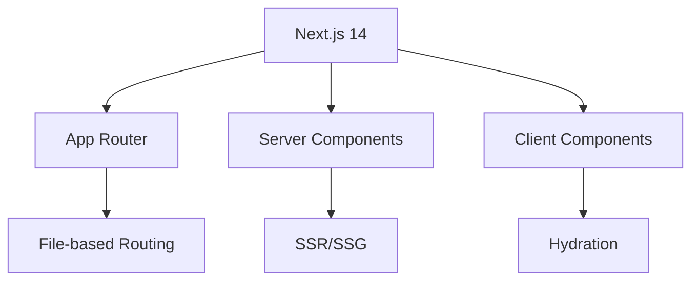
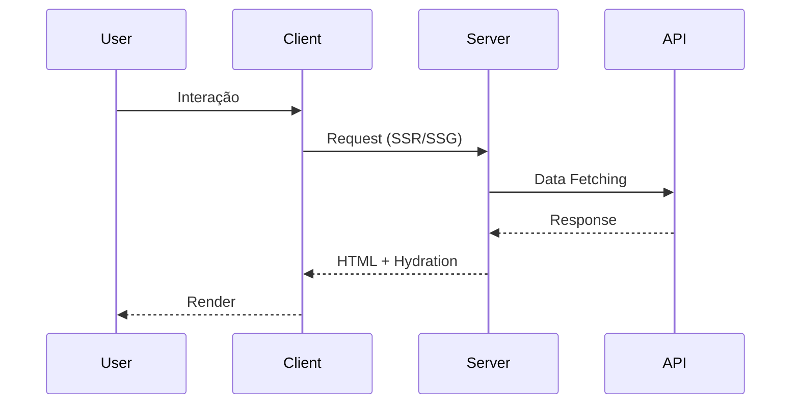
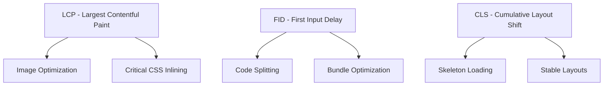
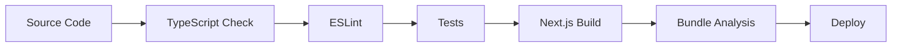

# 🏗️ Visão Geral da Arquitetura

## 📐 Filosofia Arquitetural

A arquitetura do site YesLinux segue os princípios **Security by Design** e **Performance First**, garantindo que cada decisão técnica contribua para um produto robusto, escalável e seguro.

## 🔧 Stack Tecnológico

### Frontend Framework


**Justificativa:** Next.js 14 oferece o melhor equilíbrio entre performance, SEO e developer experience, com recursos avançados de otimização automática.

### Camada de Apresentação
```mermaid
  graph LR
      A[React 18] --> B[TypeScript]
      B --> C[Tailwind CSS]
      C --> D[Framer Motion]
      D --> E[Three.js]
    
      subgraph "UI Components"
          F[Lucide Icons]
          G[Custom Components]
          H[Responsive Design]
      end
  ```

A seção de serviços usa o componente `HackerCard` disposto em uma grade responsiva.

Um componente global `Navbar` provê navegação fixa no topo com links essenciais e informações de contato.

As classes utilitárias são geradas via plugin `tailwindcss` no PostCSS, garantindo o tema hacker consistente em todos os componentes.

## 🏛️ Arquitetura de Componentes

### Hierarquia de Componentes

```
App Layout
├── Global Components (Header, Footer)
├── Page Components (Home, About, Services)
│   ├── Section Components (Hero, Services, Contact)
│   │   ├── UI Components (Button, Card, Modal)
│   │   └── Utility Components (Loading, Error)
│   └── Feature Components (Terminal, 3D)
└── Provider Components (Theme, State, Analytics)
```

### Padrões de Composição

1. **Container/Presenter Pattern**
   ```typescript
   // Container - Lógica de negócio
   export default function HeroContainer() {
     const [isLoading, setIsLoading] = useState(false)
     
     return <HeroPresenter isLoading={isLoading} />
   }
   
   // Presenter - Apenas UI
   export function HeroPresenter({ isLoading }: Props) {
     return <div>{/* UI pura */}</div>
   }
   ```

2. **Compound Components**
   ```typescript
   <Section>
     <Section.Header>Título</Section.Header>
     <Section.Content>Conteúdo</Section.Content>
     <Section.Footer>Ações</Section.Footer>
   </Section>
   ```

## 🔄 Fluxo de Dados



### Estado da Aplicação

- **Server State:** Next.js Server Components
- **Client State:** React useState/useReducer
- **Global State:** Zustand (quando necessário)
- **Cache:** React Query (para APIs futuras)

## 📦 Estrutura de Módulos

```
src/
├── app/              # Next.js App Router
│   ├── globals.css   # Estilos globais
│   ├── layout.tsx    # Layout raiz
│   └── page.tsx      # Página inicial
├── components/       # Componentes React
│   ├── sections/     # Seções específicas da página
│   ├── ui/          # Componentes reutilizáveis
│   ├── 3d/          # Componentes Three.js
│   └── terminal/    # Simulador de terminal
├── hooks/           # Custom React Hooks
├── lib/             # Utilitários e configurações
├── stores/          # Gerenciamento de estado global
└── types/           # Definições TypeScript
```

## 🔒 Arquitetura de Segurança

### Defense in Depth

1. **Client-Side Security**
   - TypeScript para type safety
   - Content Security Policy (CSP)
   - Input sanitization
   - XSS protection

2. **Server-Side Security**
   - Security headers
   - Rate limiting
   - HTTPS enforcement
   - Secure cookies

3. **Build-Time Security**
   - Dependency scanning
   - Static analysis (CodeQL)
   - License compliance

## ⚡ Arquitetura de Performance

### Core Web Vitals Strategy



### Otimizações Implementadas

- **Imagens:** Next.js Image com lazy loading
- **Fontes:** Font optimization e preload
- **JavaScript:** Dynamic imports e tree shaking
- **CSS:** Tailwind JIT e purging
- **Caching:** Static generation + CDN

## 🔧 Arquitetura de Build



### Pipeline de Qualidade

1. **Pre-commit:** Husky + lint-staged
2. **CI/CD:** GitHub Actions
3. **Quality Gates:** SonarCloud
4. **Monitoring:** Vercel Analytics

## 📈 Escalabilidade

### Preparação para Crescimento

- **Micro-frontends ready:** Modular component structure
- **API Gateway ready:** Estrutura preparada para APIs
- **Internationalization ready:** i18n structure in place
- **Database ready:** Schema design prepared

---

## 🔍 Próximos Passos

- [ ] Implementação de micro-frontends
- [ ] Integração com CMS headless
- [ ] Progressive Web App (PWA)
- [ ] Advanced analytics e tracking