# 📊 Configuração de Cobertura de Testes e SonarCloud

Este documento descreve como configurar a cobertura de testes integrada ao SonarCloud em projetos Next.js com TypeScript e Vitest.

## 🎯 Objetivo

Implementar uma pipeline completa de testes com cobertura que seja:
- **Automatizada**: Execução automática no CI/CD
- **Confiável**: Métricas precisas de cobertura 
- **Integrada**: Dados enviados para SonarCloud
- **Livre**: Usando ferramentas open source

## 🏗️ Arquitetura da Solução

```mermaid
graph TB
    A[Código Fonte] --> B[Vitest com Coverage]
    B --> C[Relatórios LCOV/JSON]
    C --> D[GitHub Actions]
    D --> E[SonarCloud Analysis]
    E --> F[Dashboard de Qualidade]
    
    B --> G[Thresholds Locais]
    G --> H[Falha se < 80%]
```



## 🔧 Configuração Completa

### 1. Dependências Necessárias

Adicione ao `package.json`:

```json
{
  "devDependencies": {
    "vitest": "^1.6.0",
    "@vitest/coverage-v8": "^1.6.0",
    "jsdom": "^24.0.0",
    "@testing-library/react": "^14.0.0",
    "@testing-library/jest-dom": "^6.2.0"
  },
  "scripts": {
    "test": "vitest run",
    "test:watch": "vitest",
    "test:coverage": "vitest run --coverage",
    "test:ui": "vitest --ui"
  }
}
```

### 2. Configuração do Vitest

Arquivo: `vitest.config.ts`

```typescript
import { defineConfig } from 'vitest/config'
import path from 'path'

export default defineConfig({
  resolve: {
    alias: {
      '@': path.resolve(__dirname, './src'),
    },
  },
  test: {
    globals: true,
    environment: 'jsdom',
    setupFiles: './vitest.setup.ts',
    coverage: {
      provider: 'v8',
      reporter: ['text', 'lcov', 'json-summary', 'html'],
      reportsDirectory: './coverage',
      exclude: [
        'node_modules/**',
        '.next/**',
        'coverage/**',
        '**/*.d.ts',
        '**/*.config.{js,ts}',
        '**/vitest.setup.ts',
      ],
      thresholds: {
        global: {
          lines: 80,
          functions: 80,
          branches: 80,
          statements: 80,
        },
      },
    },
  },
  esbuild: {
    jsx: 'automatic',
  },
})
```

### 3. Configuração do SonarCloud

Arquivo: `sonar-project.properties`

```properties
sonar.projectKey=seu-usuario_nome-projeto
sonar.organization=sua-organizacao

# Source configuration
sonar.sources=src
sonar.tests=src
sonar.test.inclusions=**/*.test.tsx,**/*.test.ts
sonar.test.exclusions=**/*.d.ts

# Coverage configuration
sonar.javascript.lcov.reportPaths=coverage/lcov.info
sonar.coverage.exclusions=**/*.test.tsx,**/*.test.ts,**/*.d.ts,**/vitest.setup.ts

# TypeScript/JavaScript configuration
sonar.typescript.tsconfigPath=tsconfig.json
```

### 4. GitHub Actions Workflow

Arquivo: `.github/workflows/test.yml`

```yaml
name: Tests and Coverage

on:
  push:
    branches: [ main ]
  pull_request:
    branches: [ main ]

permissions:
  contents: read
  security-events: write

jobs:
  test:
    name: Test and Validate
    runs-on: ubuntu-latest
    
    steps:
    - name: Checkout repository
      uses: actions/checkout@v4
      with:
        fetch-depth: 0  # Necessário para análise SonarCloud

    - name: Setup Node.js
      uses: actions/setup-node@v4
      with:
        node-version: '20.x'
        cache: 'npm'

    - name: Install dependencies
      run: |
        if [ -f "package-lock.json" ]; then
          npm ci || npm install
        else
          npm install
        fi

    - name: Run ESLint
      run: npm run lint

    - name: Run type checking
      run: npx tsc --noEmit

    - name: Run tests with coverage
      run: npm test

    - name: Check coverage threshold
      run: |
        if [ -f "coverage/coverage-summary.json" ]; then
          COVERAGE=$(node -e "const summary=require('./coverage/coverage-summary.json'); console.log(summary.total.lines.pct)")
          echo "Test coverage: ${COVERAGE}%"
          
          COVERAGE_INT=$(echo "$COVERAGE" | awk '{printf "%.0f", $1}')
          
          if [ "$COVERAGE_INT" -lt 80 ]; then
            echo "❌ Coverage ${COVERAGE}% is below minimum threshold of 80%"
            exit 1
          fi
          echo "✅ Coverage requirement met: ${COVERAGE}%"
        else
          echo "⚠️ No coverage summary found"
        fi

    - name: Upload test results
      uses: actions/upload-artifact@v4
      if: always()
      with:
        name: test-results
        path: coverage/
        retention-days: 7

  sonarcloud:
    name: SonarCloud Analysis
    runs-on: ubuntu-latest
    environment: sonarcloud
    needs: test
    if: github.event_name == 'push' || (github.event_name == 'pull_request' && github.actor != 'dependabot[bot]')
    
    steps:
    - name: Checkout repository
      uses: actions/checkout@v4
      with:
        fetch-depth: 0

    - name: Setup Node.js
      uses: actions/setup-node@v4
      with:
        node-version: '20.x'
        cache: 'npm'

    - name: Install dependencies
      run: |
        if [ -f "package-lock.json" ]; then
          npm ci || npm install
        else
          npm install
        fi

    - name: Run tests with coverage for SonarCloud
      run: npm test

    - name: SonarCloud Scan
      uses: SonarSource/sonarqube-scan-action@v5
      env:
        SONAR_TOKEN: ${{ secrets.SONAR_TOKEN }}
        GITHUB_TOKEN: ${{ secrets.GITHUB_TOKEN }}
```

## 🔐 Configuração de Secrets

### Passo 1: Configurar SonarCloud

1. **Criar conta gratuita**: Acesse https://sonarcloud.io
2. **Login com GitHub**: Autorize acesso aos repositórios
3. **Importar projeto**:
   - Clique em "+" → "Analyze new project"
   - Selecione o repositório
   - Clique "Set up"
4. **Obter informações do projeto**:
   - Anote o `Project Key` (ex: `usuario_repositorio`)
   - Anote a `Organization` (seu username do GitHub)

### Passo 2: Gerar Token

1. **No SonarCloud**: My Account → Security → Generate Tokens
2. **Nome**: `GitHub Actions - [nome-projeto]`
3. **Type**: Global Analysis Token
4. **Expires in**: No expiration (recomendado)
5. **Copie o token** (aparece apenas uma vez!)

### Passo 3: Configurar GitHub Secrets

1. **No GitHub**: Settings → Secrets and variables → Actions
2. **Adicionar secrets**:
   - Nome: `SONAR_TOKEN`
   - Value: [cole o token copiado]
3. **Verificar**: O secret deve aparecer na lista

### Passo 4: Atualizar sonar-project.properties

```properties
# Substitua pelos valores do seu projeto
sonar.projectKey=seu-usuario_nome-repositorio
sonar.organization=sua-organizacao-github
```

### ⚠️ Troubleshooting Secrets

**Se aparecer "SONAR_TOKEN not found":**

1. **Verifique o nome**: Deve ser exatamente `SONAR_TOKEN`
2. **Verifique o scope**: Secret deve estar em "Actions", não "Codespaces"
3. **Remova environments**: Não use `environment: sonarcloud` no workflow
4. **Teste localmente**:
   ```bash
   export SONAR_TOKEN="seu-token-aqui"
   npx sonar-scanner
   ```

## 📋 Checklist de Implementação

### ✅ Configuração Local
- [ ] Instalar dependências: `npm install`
- [ ] Configurar `vitest.config.ts`
- [ ] Criar `vitest.setup.ts`
- [ ] Testar localmente: `npm test`

### ✅ Configuração SonarCloud
- [ ] Criar projeto no SonarCloud
- [ ] Configurar `sonar-project.properties`
- [ ] Obter `SONAR_TOKEN`
- [ ] Configurar Quality Gate

### ✅ Configuração CI/CD
- [ ] Criar workflow `.github/workflows/test.yml`
- [ ] Adicionar secrets no GitHub
- [ ] Criar environment `sonarcloud`
- [ ] Testar com PR

### ✅ Validação
- [ ] Coverage aparece no SonarCloud
- [ ] Thresholds funcionam (falha se < 80%)
- [ ] Artifacts são gerados
- [ ] Quality Gate passa/falha corretamente

## 🐛 Troubleshooting

### Problema: "Missing dependencies from lock file"
**Solução:** Todos os workflows usam fallback automático:
```bash
# Aplicado em todos os workflows
if [ -f "package-lock.json" ]; then
  npm ci || npm install
else
  npm install
fi
```

**Arquivos corrigidos:**
- `.github/workflows/test.yml`
- `.github/workflows/security.yml` 
- `.github/workflows/pr-checks.yml`

### Problema: Coverage não aparece no SonarCloud
**Verificar:**
1. Arquivo `coverage/lcov.info` é gerado
2. Path no `sonar-project.properties` está correto
3. `fetch-depth: 0` no checkout
4. `SONAR_TOKEN` está configurado

### Problema: "Coverage file not found"
**Solução:** Script de teste foi configurado corretamente:
```json
{
  "scripts": {
    "test": "vitest run --coverage"
  }
}
```

### Problema: Testes falhando no CI
**Verificações automáticas adicionadas:**
1. Verifica se `vitest` está disponível antes de executar
2. Reinstala dependências se necessário
3. Environment `jsdom` configurado
4. Coverage sempre gerado com `all: true`

### Problema: "vitest command not found"
**Solução:** Workflows verificam dependências automaticamente:
```bash
if ! npx vitest --version > /dev/null 2>&1; then
  npm install
fi
```

## 🎯 Resultados Esperados

Com esta configuração você terá:

✅ **Pipeline Automatizada**
- Testes executam em cada push/PR
- Cobertura calculada automaticamente
- Falha se cobertura < 80%

✅ **Integração SonarCloud**
- Métricas de qualidade centralizadas
- Histórico de evolução da cobertura
- Quality Gate integrado ao PR

✅ **Documentação Viva**
- Relatórios HTML de cobertura
- Artifacts disponíveis por 7 dias
- Feedback imediato nos PRs

✅ **Padrões de Qualidade**
- 80% mínimo de cobertura
- Type safety com TypeScript
- Linting obrigatório

## 📚 Recursos Adicionais

- [Documentação Vitest](https://vitest.dev/)
- [SonarCloud Docs](https://docs.sonarcloud.io/)
- [GitHub Actions](https://docs.github.com/en/actions)
- [Coverage.py](https://coverage.readthedocs.io/) (para Python)

---

## 🚀 Para Usar Esta Configuração

Este setup é **software livre** e pode ser reutilizado em qualquer projeto:

1. **Clone este exemplo**
2. **Adapte os nomes** (projectKey, organization)
3. **Configure seus secrets**
4. **Customize thresholds** conforme necessário
5. **Documente as mudanças** para sua equipe

**Licença:** MIT - Use livremente, contribua com melhorias!

---

*Configuração testada e validada no projeto YesLinux - exemplo de desenvolvimento seguro e boas práticas.*