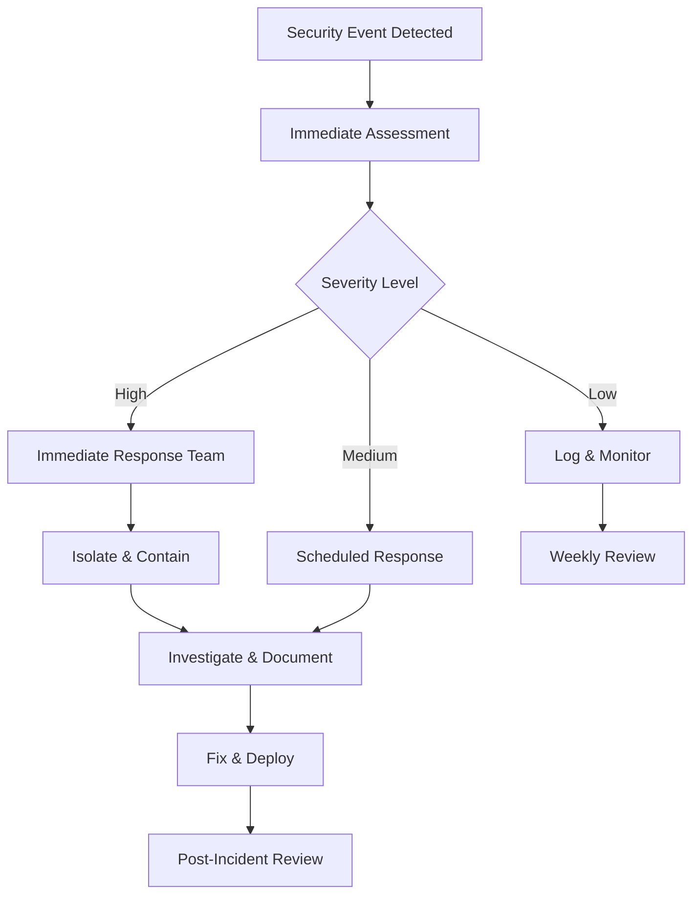

# 🔒 Práticas de Segurança

## 🎯 Segurança como Prioridade

Na YesLinux, **segurança não é uma funcionalidade adicional, é o foundation** de tudo que desenvolvemos. Este documento estabelece as práticas obrigatórias para manter o mais alto nível de segurança em nossos projetos.

## 🛡️ Defense in Depth Strategy

### Camada 1: Desenvolvimento Seguro

#### Code Security Standards

```typescript
// ✅ SEMPRE: Validação rigorosa de inputs
import { z } from 'zod'

const userInputSchema = z.object({
  email: z.string().email().max(255),
  name: z.string().min(2).max(100).regex(/^[a-zA-Z\s]*$/),
  message: z.string().min(10).max(1000)
})

function processUserInput(rawData: unknown) {
  try {
    const validData = userInputSchema.parse(rawData)
    return validData
  } catch (error) {
    // Log security event
    securityLogger.warn('Invalid input detected', { rawData })
    throw new ValidationError('Invalid input format')
  }
}

// ❌ NUNCA: Confiar em dados externos
function unsafeProcess(data: any) {
  // PERIGOSO - dados não validados
  database.query(`SELECT * FROM users WHERE id = ${data.id}`)
}
```

#### XSS Prevention

```typescript
// ✅ Sanitização adequada
import DOMPurify from 'dompurify'

function SafeContentRenderer({ userContent }: { userContent: string }) {
  const sanitizedContent = DOMPurify.sanitize(userContent, {
    ALLOWED_TAGS: ['p', 'br', 'strong', 'em'],
    ALLOWED_ATTR: []
  })
  
  return (
    <div 
      dangerouslySetInnerHTML={{ __html: sanitizedContent }}
    />
  )
}

// ❌ NUNCA renderizar HTML não sanitizado
function UnsafeRenderer({ userContent }: { userContent: string }) {
  return <div dangerouslySetInnerHTML={{ __html: userContent }} />
}
```

#### CSRF Protection

```typescript
// ✅ CSRF tokens em formulários críticos
import { getCsrfToken } from 'next-auth/react'

async function SecureForm() {
  const csrfToken = await getCsrfToken()
  
  return (
    <form method="POST" action="/api/secure-endpoint">
      <input name="csrfToken" type="hidden" value={csrfToken} />
      {/* Outros campos */}
    </form>
  )
}
```

### Camada 2: Headers de Segurança

```javascript
// next.config.js
const securityHeaders = [
  {
    key: 'Content-Security-Policy',
    value: [
      "default-src 'self'",
      "script-src 'self' 'unsafe-eval' 'unsafe-inline' *.vercel-analytics.com",
      "style-src 'self' 'unsafe-inline'",
      "img-src 'self' blob: data: *.vercel.app",
      "font-src 'self'",
      "connect-src 'self' *.vercel-analytics.com vitals.vercel-insights.com",
      "frame-ancestors 'none'"
    ].join('; ')
  },
  {
    key: 'X-Frame-Options',
    value: 'DENY'
  },
  {
    key: 'X-Content-Type-Options',
    value: 'nosniff'
  },
  {
    key: 'Referrer-Policy',
    value: 'strict-origin-when-cross-origin'
  },
  {
    key: 'Permissions-Policy',
    value: [
      'camera=()',
      'microphone=()',
      'geolocation=()',
      'payment=()'
    ].join(', ')
  }
]
```

### Camada 3: Dependency Security

#### Automated Scanning

```yaml
# .github/workflows/security.yml
- name: Run npm audit
  run: npm audit --audit-level=moderate

- name: OWASP Dependency Check
  uses: dependency-check/Dependency-Check_Action@main
  with:
    project: 'yeslinux-website'
    path: '.'
    format: 'HTML'
```

#### Manual Review Process

```bash
# Verificação semanal obrigatória
npm audit
npm outdated

# Análise de licenças
npx license-checker --summary

# Verificação de vulnerabilidades específicas
npx audit-ci --config ./audit-ci.json
```

## 🔍 Security Monitoring

### Logging de Eventos de Segurança

```typescript
interface SecurityEvent {
  type: 'AUTH_FAILURE' | 'INVALID_INPUT' | 'RATE_LIMIT' | 'XSS_ATTEMPT'
  timestamp: Date
  userAgent: string
  ip: string
  details: Record<string, unknown>
}

class SecurityLogger {
  static logEvent(event: SecurityEvent) {
    // Em desenvolvimento
    console.warn('SECURITY EVENT:', event)
    
    // Em produção - enviar para sistema de monitoring
    if (process.env.NODE_ENV === 'production') {
      this.sendToSecuritySiem(event)
    }
  }
  
  private static sendToSecuritySiem(event: SecurityEvent) {
    // Integração com sistema de SIEM
    // Vercel Analytics, DataDog, etc.
  }
}
```

### Rate Limiting

```typescript
// middleware.ts
import { NextRequest, NextResponse } from 'next/server'
import { RateLimiter } from '@/lib/rate-limiter'

const limiter = new RateLimiter({
  windowMs: 15 * 60 * 1000, // 15 minutos
  max: 100, // máximo 100 requests por IP
  message: 'Too many requests, please try again later'
})

export async function middleware(request: NextRequest) {
  // Aplicar rate limiting em endpoints críticos
  if (request.nextUrl.pathname.startsWith('/api/contact')) {
    const isAllowed = await limiter.check(getClientIP(request))
    
    if (!isAllowed) {
      SecurityLogger.logEvent({
        type: 'RATE_LIMIT',
        timestamp: new Date(),
        userAgent: request.headers.get('user-agent') || '',
        ip: getClientIP(request),
        details: { endpoint: request.nextUrl.pathname }
      })
      
      return new NextResponse('Rate limit exceeded', { status: 429 })
    }
  }
  
  return NextResponse.next()
}
```

## 🔧 Security Development Workflow

### 1. Pre-Development Security Review

```markdown
## Security Checklist para Novas Features

- [ ] **Threat Modeling:** Quais são os possíveis vetores de ataque?
- [ ] **Data Flow:** Como os dados fluem pelo sistema?
- [ ] **Authentication:** Precisa de autenticação/autorização?
- [ ] **Input Validation:** Todos os inputs serão validados?
- [ ] **Output Encoding:** Dados de saída serão sanitizados?
- [ ] **Error Handling:** Erros não vazam informações sensíveis?
```

### 2. Code Review Security Checklist

```markdown
## Security Review Checklist

### Inputs & Validation
- [ ] Todos os inputs são validados com schemas TypeScript
- [ ] Validação server-side implementada
- [ ] Sanitização adequada de HTML/SQL
- [ ] Rate limiting em endpoints sensíveis

### Outputs & Data Exposure  
- [ ] Nenhum dado sensível em logs
- [ ] Sanitização de outputs HTML
- [ ] Headers de segurança adequados
- [ ] Informações de erro não vazam dados internos

### Dependencies
- [ ] Novas dependências auditadas
- [ ] Licenças compatíveis verificadas
- [ ] Vulnerabilidades conhecidas verificadas
```

### 3. Security Testing

```typescript
// security.test.ts
describe('Security Tests', () => {
  describe('XSS Prevention', () => {
    it('should sanitize malicious HTML input', () => {
      const maliciousInput = '<script>alert("XSS")</script><p>Safe content</p>'
      const result = sanitizeHTML(maliciousInput)
      
      expect(result).not.toContain('<script>')
      expect(result).toContain('<p>Safe content</p>')
    })
  })

  describe('Input Validation', () => {
    it('should reject invalid email formats', () => {
      expect(() => validateEmail('invalid-email')).toThrow()
      expect(() => validateEmail('valid@email.com')).not.toThrow()
    })
  })

  describe('CSRF Protection', () => {
    it('should include CSRF token in forms', () => {
      const { getByDisplayValue } = render(<ContactForm />)
      expect(getByDisplayValue(/^[a-zA-Z0-9-_]+$/)).toBeInTheDocument()
    })
  })
})
```

## 🚨 Incident Response

### Security Incident Workflow



### Escalation Matrix

| Severity | Examples | Response Time | Team |
|----------|----------|---------------|------|
| **Critical** | Data breach, RCE, Auth bypass | Immediate | Security Lead + CTO |
| **High** | XSS, CSRF, Sensitive data exposure | < 2 hours | Security Team |
| **Medium** | Rate limiting, Info disclosure | < 24 hours | Dev Team |
| **Low** | Minor config issues | < 1 week | Regular Maintenance |

## 📊 Security Metrics

### KPIs de Segurança

```markdown
## Métricas Obrigatórias

### Código
- **Vulnerabilities:** 0 (zero tolerance)  
- **Security Code Smells:** < 5
- **Dependency Vulnerabilities:** 0 critical, < 3 high

### Testing
- **Security Test Coverage:** > 90%
- **Penetration Testing:** Quarterly
- **Security Reviews:** All PRs

### Monitoring  
- **Security Events:** < 10/week
- **False Positives:** < 5%
- **Incident Response Time:** < SLA targets
```

### Ferramentas de Monitoramento

```yaml
# Ferramentas obrigatórias em produção
security_tools:
  static_analysis: "SonarCloud + CodeQL"
  dependency_scanning: "npm audit + OWASP Dependency Check"
  runtime_monitoring: "Vercel Security + Custom Logging"
  penetration_testing: "Quarterly external audit"
```

## 🎓 Security Training

### Recursos Obrigatórios

- **OWASP Top 10:** Conhecimento obrigatório
- **Secure Coding:** Curso interno YesLinux
- **Threat Modeling:** Workshop trimestral
- **Incident Response:** Simulações mensais

### Certificações Recomendadas

- **CEH (Certified Ethical Hacker)**
- **CISSP (Security Professional)**
- **OSCP (Offensive Security)**

---

## 🏆 Security Champions Program

### Responsabilidades

- 🔍 **Security Reviews:** Revisar PRs com foco em segurança
- 📚 **Knowledge Sharing:** Disseminar boas práticas
- 🚨 **Incident Response:** Primeiros respondentes
- 📊 **Metrics:** Monitorar KPIs de segurança

---

<div align="center">
  <p><strong>🛡️ Security is not a feature, it's a foundation</strong></p>
  <p><em>YesLinux Security Team</em></p>
</div>